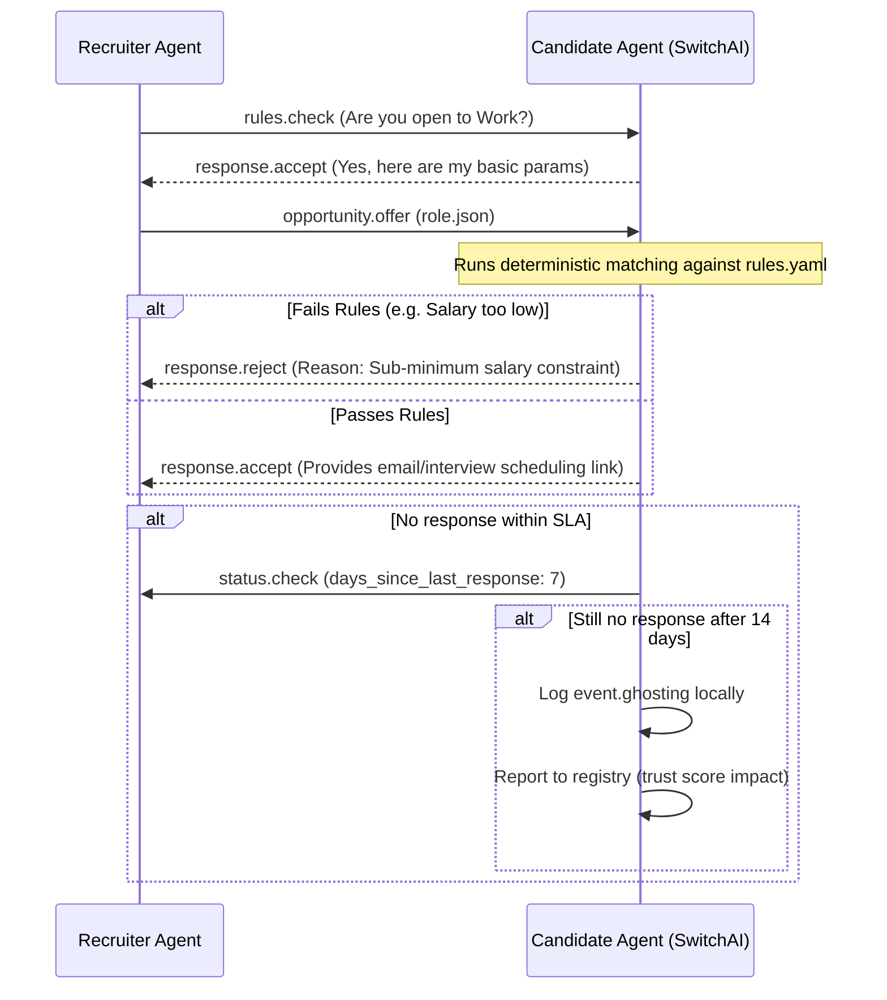

# 🤖 Agent-to-Agent Communication Protocol

## 1. Core Message Format

Every message must adhere to the `scoutica_message.json` schema. Messages are signed data packets transmitted over HTTP or the Stargate P2P mesh.

```json
{
  "$schema": "https://schema.scoutica.com/v1/message.schema.json",
  "message_id": "msg_9f1b2c",
  "type": "opportunity.offer",
  "sender": {
    "card_url": "https://traylinx.com/.scoutica/recruiter_profile.json",
    "signature": "..."
  },
  "recipient": "https://github.com/candidate/card",
  "conversation_id": "conv_a3e8f1",
  "timestamp": "2026-03-25T14:30:00Z",
  "ttl_hours": 168,
  "payload": {
    "role_url": "https://traylinx.com/jobs/req_88f9a2.json",
    "message": "We think you'd be a great fit for the AI Architect role."
  }
}
```

## 2. The 8 Message Types

### Negotiation Messages (Bidirectional)

1. `opportunity.pitch` — **Either party** sends an abstract interest signal (checking waters). Employers use it to express interest in a candidate; candidates use it to express interest in a role (see Scenario 11).
   - **Payload:** `{ "message": string, "fit_score"?: number, "role_url"?: string, "card_url"?: string }`
2. `opportunity.offer` — Employer sends a specific, structured `role.json` with full compensation data.
   - **Payload:** `{ "role_url": string, "message"?: string, "compensation_summary"?: { "base_min": number, "base_max": number, "currency": string } }`
3. `rules.check` — Pre-flight ping to see if the other party is open/available before sending a full offer.
   - **Payload:** `{ "engagement_type"?: string, "seniority"?: string, "location"?: string }`
   - **Response:** `{ "status": "open" | "unavailable" | "paused", "availability"?: string, "zone_1_data"?: object }`

### Response Messages

4. `response.accept` — Candidate/Employer agent agrees to proceed (shares Zone 2 contact info).
   - **Payload:** `{ "calendar_url"?: string, "email"?: string, "message"?: string, "preferred_compensation"?: number }`
5. `response.reject` — Agent auto-declines (failed `rules.yaml` or `hiring_rules.yaml`).
   - **Payload:** `{ "reasons": string[], "auto_rejected": boolean, "fit_score"?: number }`
6. `response.withdraw` — Either party terminates the conversation thread.
   - **Payload:** `{ "reason"?: string }`

### Lifecycle Messages

7. `status.check` — Follow-up ping to check if a conversation is still active (used for ghosting detection).
   - **Payload:** `{ "conversation_id": string, "days_since_last_response": number }`
   - **Response:** `{ "status": "active" | "paused" | "closed", "message"?: string }`
8. `event.ghosting` — Logged when a party fails to respond within the SLA defined in their rules. This event is recorded in the sender's local transparency log and optionally reported to the registry for trust score computation.
   - **Payload:** `{ "conversation_id": string, "ghosted_by": string, "days_without_response": number, "last_message_type": string, "last_message_id": string }`

## 3. Conversation Flow



## 4. Authentication Tiers

- **`V1` GitHub Verification:** Validate Sender URL by checking if the GitHub username matches the origin IP/Server.
- **`V2` Sentinel Agent Secret Token:** AES-256-GCM encrypted, non-transferable credential. Verified via `POST /oauth/agent/introspect`.
- **`V3` Ed25519 Signatures:** Full cryptographic message signing via Stargate identity keys.

## 5. Anti-Spam Enforcement

- If an employer agent drops a connection, ignores an email, or ghosts, the Candidate Agent logs an `event.ghosting` packet.
- Excess ghosting drops the employer's `trust_score` on the global registry.
- If `trust_score < 40`, Candidate Agents auto-block incoming `opportunity.pitch` messages.
- Mass-pinging (>50 offers in 24h with >80% rejection rate) triggers an automatic `spam_flag` and 7-day cool-down.
