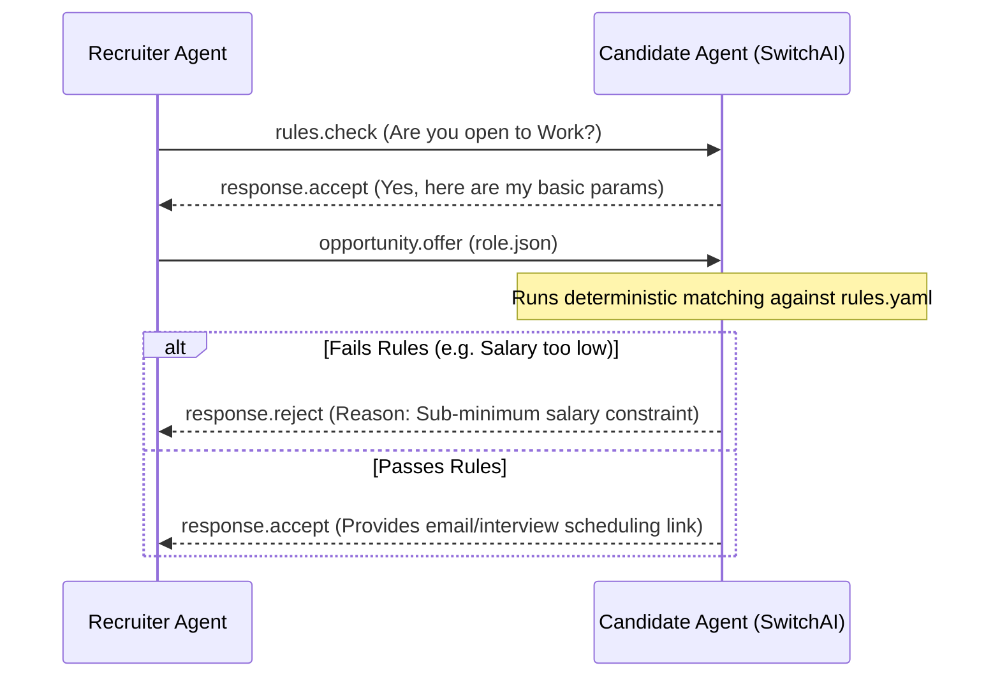

# 🤖 Agent-to-Agent Communication Protocol

## 1. Core Message Format

Every message must adhere to the `scoutica_msg.json` schema. Messages are signed data packets transmitted over HTTP.

```json
{
  "$schema": "https://schema.scoutica.com/v1/message.json",
  "message_id": "msg_9f1b2c",
  "type": "opportunity.offer",
  "sender": {
    "recruiter_card_url": "https://traylinx.com/.scoutica/recruiter.json",
    "signature": "..."
  },
  "recipient": "https://github.com/candidate/card",
  "timestamp": "2026-03-25T14:30:00Z",
  "payload": {
    "role_url": "https://traylinx.com/jobs/req_88f9a2.json",
    "message": "We think you'd be a great fit for the AI Architect role."
  }
}
```

## 2. The 6 Message Types

1. `opportunity.pitch` — Recruiter sends abstract role description (checking waters).
2. `opportunity.offer` — Recruiter sends specific, structured `role.json`.
3. `rules.check` — Pre-flight ping to see if candidate is open/available before sending full offer.
4. `response.accept` — Candidate agent agrees to proceed (shares contact info).
5. `response.reject` — Candidate agent auto-declines (failed `rules.yaml`).
6. `response.withdraw` — Either party terminates the conversation thread.

## 3. Conversation Flow



## 4. Authentication Tiers

- **`V1` GitHub Verification:** Validate Sender URL by checking if the GitHub username matches the origin IP/Server.
- **`V2` API Keys / JWT:** Explicit generation of API keys over standard HTTP/TLS (standard web2).
- **`V3` Decentralized Identifiers (DIDs):** Cryptographic signatures proving authorship via ed25519 pairs.

## 5. Anti-Spam Enforcement
- If an employer agent drops a connection, ignores an email, or ghosts, the Candidate Agent logs an `event.ghosting` packet.
- Excess ghosting drops the employer's `trust_score` on the global registry.
- If `trust_score < 40`, Candidate Agents auto-block incoming `opportunity.pitch` messages.
