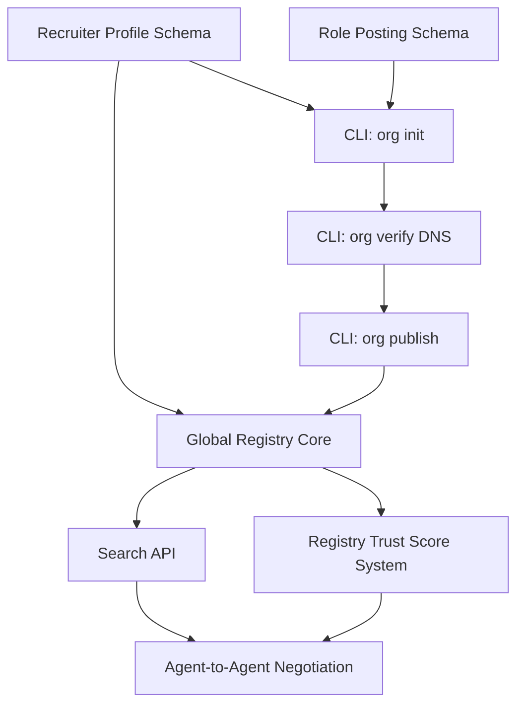

# 🗺️ Implementation Roadmap (Recruiter Network)

## 4-Phase Build Plan

The Scoutica Recruiter Network will roll out in four discrete phases to ensure stability, adoption, and security.

### Phase 1: Schemas & Identifiers (Weeks 1-3)
**Objective:** Establish the data models for the Employer side.
- [ ] Draft `recruiter_profile.json` JSON schema.
- [ ] Draft `role.json` (Job Posting) schema.
- [ ] Finalize `rules.yaml` standard mapping to ensure `role.json` compatibility.
- [ ] Publish schemas to `scoutica.com/schemas/v1/`.

### Phase 2: Recruiter CLI & Verification (Weeks 4-7)
**Objective:** Allow organizations to build and verify their identities.
- [ ] `scoutica org init` setup wizard.
- [ ] Implement DNS TXT record verification for `scoutica org verify`.
- [ ] Basic markdown generation (`RECRUITER.md`).
- [ ] `scoutica org publish` to GitHub.

### Phase 3: Global Registry API (Weeks 8-13)
**Objective:** Make candidates searchable.
- [ ] Deploy central `registry.scoutica.com` PostgreSQL/pgvector database.
- [ ] Create `POST /api/register` for auto-indexing cards.
- [ ] Create `GET /api/search` with keyword and hard-filter querying.
- [ ] Deploy GitHub Action `traylinx/scoutica-action` to auto-publish on every commit.

### Phase 4: Agent-to-Agent Handshake (Weeks 14-22)
**Objective:** End-to-end autonomous negotiation.
- [ ] Build `switchAILocal` plugin for "Candidate Auto-Response".
- [ ] Define the exact webhooks (`POST /scoutica/inbox`).
- [ ] Implement cryptographic payload signing for anti-spam.

## Priority Matrix & Dependency Graph

## Open Questions for Review
1. Should `rules.yaml` scoring be strictly boolean (rejects if one failure) or weighted (forgive low salary if remote = 100%)?
2. Do we fund the central Registry V2 via "premium employer searches", or keep it purely open-source?
3. Should the DNS verification step be required before a recruiter can execute a search on the V2 API?
4. Are we treating hiring agencies differently than in-house corporate recruiters in the schemas?
