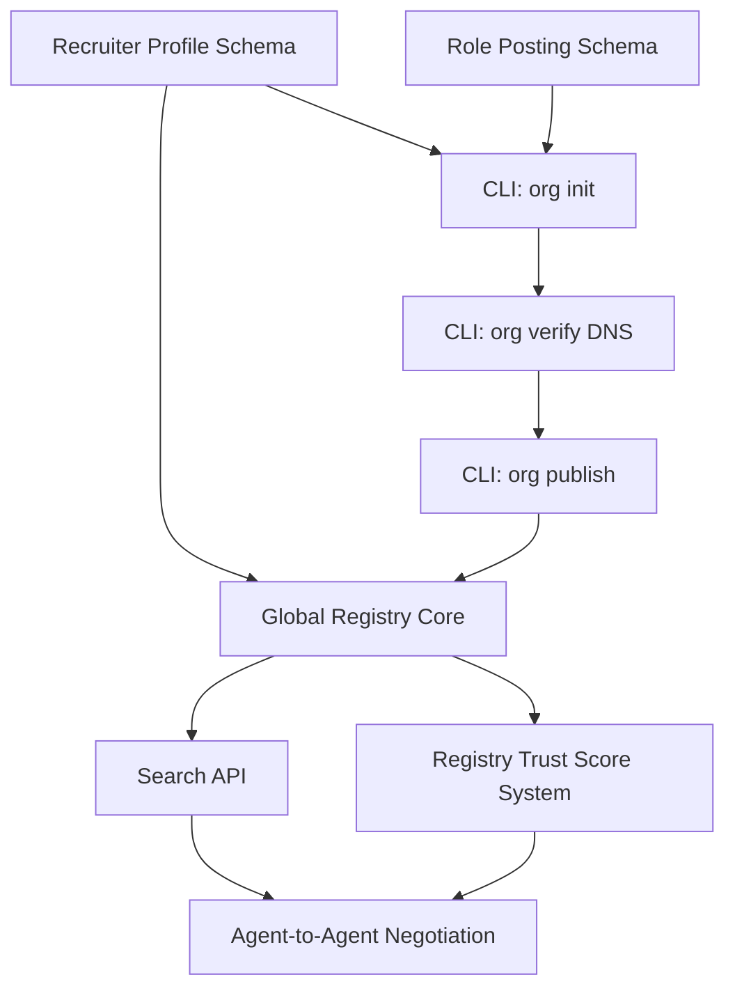

# 🗺️ Implementation Roadmap (Recruiter Network)

## 4-Phase Build Plan

The Scoutica Recruiter Network will roll out in four discrete phases to ensure stability, adoption, and security.

### Phase 1: Schemas & Identifiers (Weeks 1-3)
**Objective:** Establish the data models for the Employer side.
- [ ] Draft `recruiter_profile.json` JSON schema.
- [ ] Draft `role.json` (Job Posting) schema.
- [ ] Finalize `rules.yaml` standard mapping to ensure `role.json` compatibility.
- [ ] Publish schemas to `scoutica.com/schemas/v1/`.

### Phase 2: Recruiter CLI & Verification (Weeks 4-7)
**Objective:** Allow organizations to build and verify their identities.
- [ ] `scoutica org init` setup wizard.
- [ ] Implement DNS TXT record verification for `scoutica org verify`.
- [ ] Basic markdown generation (`RECRUITER.md`).
- [ ] `scoutica org publish` to GitHub.

### Phase 3: Global Registry API (Weeks 8-13)
**Objective:** Make candidates searchable.
- [ ] Deploy central `registry.scoutica.com` PostgreSQL/pgvector database.
- [ ] Create `POST /api/register` for auto-indexing cards.
- [ ] Create `GET /api/search` with keyword and hard-filter querying.
- [ ] Deploy GitHub Action `traylinx/scoutica-action` to auto-publish on every commit.

### Phase 4: Agent-to-Agent Handshake (Weeks 14-22)
**Objective:** End-to-end autonomous negotiation.
- [ ] Build `switchAILocal` plugin for "Candidate Auto-Response".
- [ ] Define the exact webhooks (`POST /scoutica/inbox`).
- [ ] Implement cryptographic payload signing for anti-spam.

## Priority Matrix & Dependency Graph

## Resolved Design Decisions

> These questions were originally flagged as open. They are now resolved and documented here for the permanent record.

### Q1: Boolean vs Weighted Scoring?

**Decision: Hybrid.** Hard filters (salary, location, blocked industries, engagement type) are strictly **boolean pass/fail**. If any hard filter fails, the candidate is immediately dropped. Soft scoring (skill overlap, evidence quality, title match) is **weighted** on a 0-100 scale. See `03_JOB_POSTING_CARD.md` §2 for the exact algorithm.

### Q2: Registry Funding Model?

**Decision: Deferred to Phase 3+.** In Phase 1-2, the registry is a GitHub-hosted static `index.json` (zero-cost infrastructure). Funding only becomes relevant when we deploy the V2 REST API with `pgvector`. Potential models to evaluate:
- Freemium (free for `new/building` tier, paid for `trusted/elite` API access)
- Fully open-source with community-funded infrastructure
- Premium features (analytics dashboards, batch search APIs)

### Q3: DNS Verification Required for Search?

**Decision: Yes, but phased.**
- **V1** (GitHub topics): No DNS required — anyone can search because data is publicly accessible on GitHub.
- **V2+** (REST API): DNS verification **required** for any search beyond `anonymous` tier (10 searches/day). See `02_RECRUITER_CARD.md` §7 for the DNS verification protocol.

### Q4: Agency vs In-House Schema Differences?

**Decision: Already resolved.** The `entity_type` field in `recruiter_profile.json` distinguishes between `"in-house"`, `"agency"`, `"fractional"`, and `"platform"`. Trust accrues to the **client org**, not the agency (see `07_SCENARIOS.md` Scenario 9). No further schema differentiation needed — the same `role.json` is used regardless of entity type.
