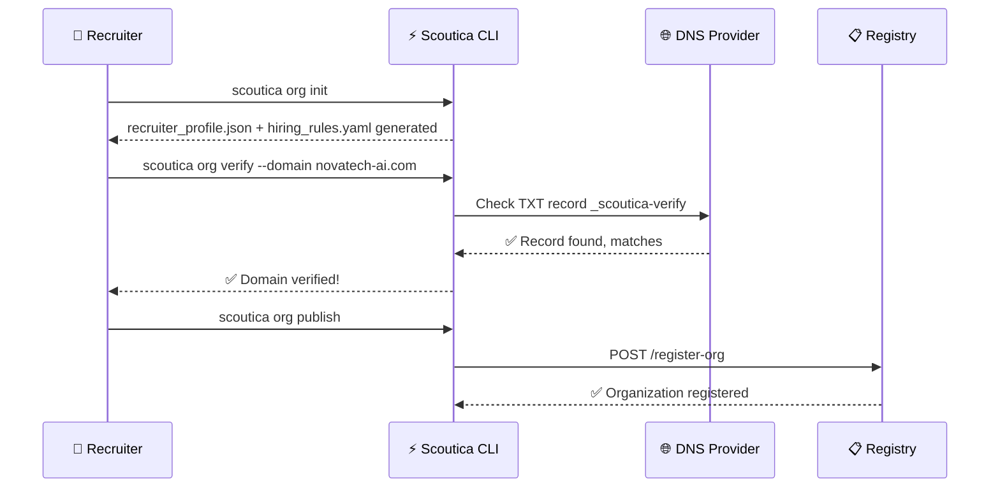
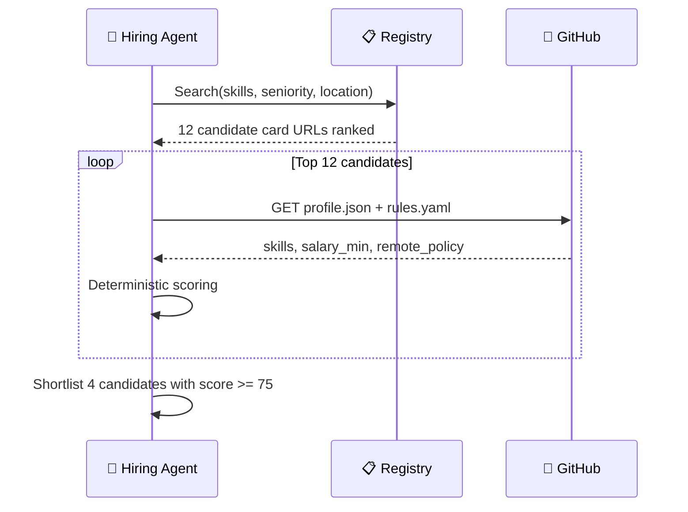
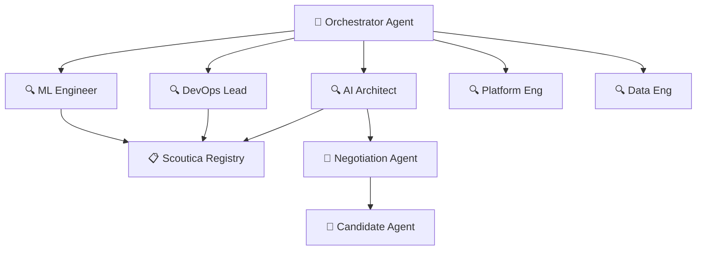
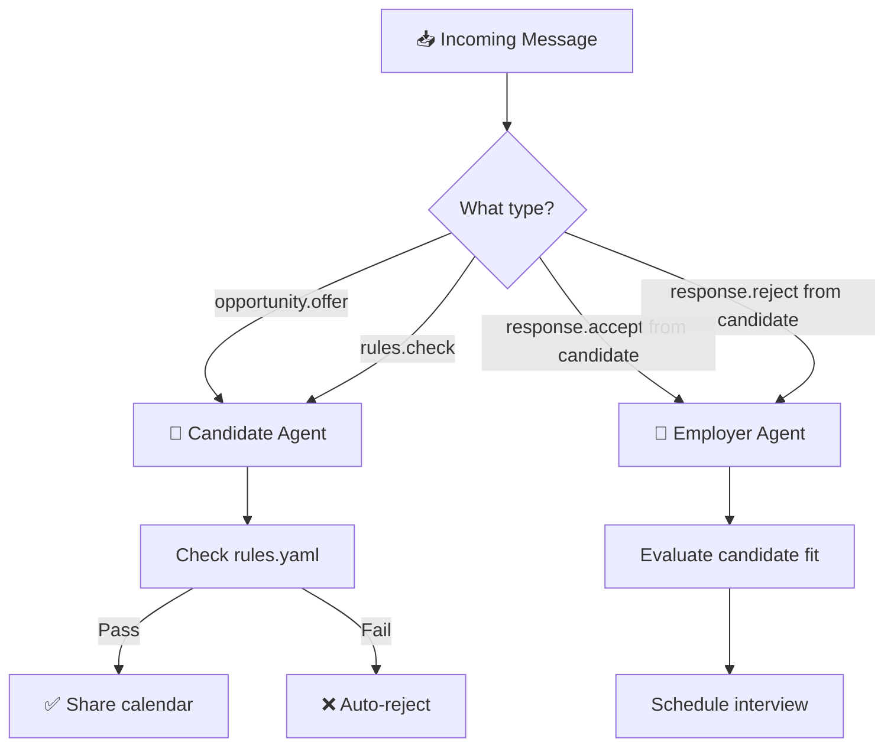

# 🎬 End-to-End Scenarios — Recruiter Network

Eleven complete walkthroughs showing how both sides of the Scoutica network operate in real-world conditions.

> **Participants Terminology:**
> - **Candidate** — The human professional. Represented by a Candidate Agent.
> - **Employer** — The company, recruiter, or hiring manager. Represented by an Employer Agent.

---

## Scenario 1: Recruiter Onboarding (First-Time Setup)

> A talent acquisition lead at "NovaTech AI" wants to start sourcing through the Scoutica network.

### Steps

1. **Install CLI:** `curl -fsSL https://scoutica.com/install.sh | bash`
2. **Initialize Org Card:** `scoutica org init`
   - Prompts for: org name, domain, industries, team size, engagement types, **team model** (solo/organization/agency)
   - Generates: `recruiter_profile.json`, `hiring_rules.yaml`
3. **Verify Domain:** `scoutica org verify --domain novatech-ai.com`
   - CLI generates a DNS TXT record: `_scoutica-verify=v1:sha256:a7f9b2...`
   - User adds it to their DNS → CLI polls until confirmed
4. **Publish:** `scoutica org publish`
   - Pushes to `github.com/novatech-ai/.scoutica/`
   - Registers with the global index

### Outcome

NovaTech AI now has a verified recruiter identity. Their `trust_level` starts at `building`.



---

## Scenario 2: Posting a Structured Job

> NovaTech AI has a "Senior AI Architect" role to fill.

### Steps

1. **Create Role:** `scoutica role create`
   - Interactive wizard or JSON import
   - Generates `role.json` with hard skills, compensation, location policy
2. **Validate:** `scoutica role validate senior-ai-architect.json`
   - Checks schema compliance, compensation range sanity, ghost job prevention timestamp
3. **Publish:** `scoutica role publish senior-ai-architect.json`
   - Registers in the global role index
   - Sets 30-day expiration timer (anti-ghost)

### Files Generated

```text
novatech-ai/.scoutica/
├── recruiter_profile.json
├── hiring_rules.yaml
└── roles/
    └── senior-ai-architect.json
```

---

## Scenario 3: Candidate Discovery (Search & Filter)

> NovaTech's hiring agent searches for matching candidates.

### Steps

1. **Search:** Agent queries the registry:
   ```text
   GET /api/v1/search?skills=python,agentic-ai&seniority=senior&location=remote-eu
   ```
2. **Results:** Registry returns 12 candidate card URLs, ranked by freshness + evidence density
3. **Fetch Cards:** Agent reads `profile.json` + `rules.yaml` from each
4. **Pre-Screen:** Deterministic matching against `role.json`:
   - Hard filter: location ✅, salary range ✅, engagement type ✅
   - Skill score: 8/10 required skills matched = 80 points
   - Evidence bonus: 3 verified GitHub repos matching key skills = +15 points
   - **Total: 95 → Strong Match**
5. **Shortlist:** 4 candidates pass the threshold (score ≥ 75)



---

## Scenario 4: First Contact (The Handshake)

> NovaTech's agent reaches out to Sebastian's Candidate Agent.

### Steps

1. **Rules Check (Pre-Flight):** Employer sends `rules.check`. Candidate agent responds: open, available in 2 weeks.
2. **Opportunity Offer:** Employer sends structured `opportunity.offer` with `role.json` URL and compensation range (€120k-€150k).
3. **Candidate Agent Auto-Evaluation:**
   - salary_min €110k → €120k offer ✅
   - Remote policy: required → role is remote ✅
   - Blocked industries: crypto gambling → NovaTech is AI ✅
   - Recruiter trust level: `building` → minimum required: `building` ✅
4. **Response:** `response.accept` with calendar link and preferred compensation (€135k).

---

## Scenario 5: Automated Rejection (Rules Mismatch)

> A low-effort agency sends a mass pitch to Sebastian.

### What Happens

1. Agency "QuickHire" has `trust_level: "new"` (unverified domain)
2. Sends `opportunity.pitch` for a role offering €75k (below Sebastian's €110k minimum)
3. Candidate Agent auto-evaluates: Salary FAIL + Trust FAIL
4. **Auto-reject** with reasons: `["salary_below_minimum", "recruiter_trust_insufficient"]`
5. **No PII leaked.** QuickHire never sees email, phone, or calendar link.

---

## Scenario 6: Ghosting Detection & Trust Decay

> NovaTech sent an offer, Sebastian accepted, but NovaTech never schedules the interview.

### Timeline

- **Day 0:** `response.accept` sent with calendar link
- **Day 7:** Candidate Agent sends `status.check` ping — no response
- **Day 14:** Candidate Agent logs `event.ghosting`
- **Effect:** NovaTech's `trust_score` drops by 5 points. 3+ ghost events → drops from `building` to `new`.

---

## Scenario 7: GDPR Data Access Request

> Sebastian wants to know what data NovaTech collected from his card.

### Steps

1. Sebastian runs: `scoutica privacy audit novatech-ai`
2. CLI shows the transparency log: which files were accessed, when, and from which zone
3. Sebastian can revoke Zone 2 access: `scoutica privacy revoke novatech-ai`

---

## Scenario 8: Multi-Agent Swarm Sourcing

> A large enterprise uses its Scoutica Orchestrator Agent to fill 5 roles simultaneously.

### Architecture



### Flow

1. Orchestrator takes 5 `role.json` files as input
2. Spawns 5 parallel Sourcing Agents
3. Each queries the registry, fetches cards, runs deterministic matching
4. Top candidates forwarded to Negotiation Agent
5. Results aggregated with timing + trust metrics

---

## Scenario 9: Agency Managing Multiple Clients

> "TalentForge" is a recruiting agency that manages hiring for 3 client companies.

### Setup

```text
github.com/talentforge/.scoutica/          ← Agency identity (type: "agency")
github.com/client-alpha/.scoutica/         ← TalentForge is a collaborator
github.com/client-beta/.scoutica/          ← TalentForge is a collaborator
github.com/client-gamma/.scoutica/         ← TalentForge is a collaborator
```

### Flow

1. TalentForge recruiter Alice runs: `scoutica role create --org client-alpha`
2. CLI generates `role.json` inside `client-alpha/.scoutica/roles/`
3. When published, it appears under **Client Alpha's identity** (not TalentForge's)
4. All trust scoring applies to **Client Alpha**, not TalentForge
5. Git commit shows `Author: alice@talentforge.com` — full individual accountability

### Key Rule

Trust is earned **per-org**, not per-agency. If TalentForge ghosts candidates on behalf of Client Alpha, it is Client Alpha's trust score that drops. This incentivizes clients to hold their agencies accountable.

---

## Scenario 10: Dual-Agent (Same Person, Two Roles)

> Sebastian is both a **Candidate** (open to advisory roles) AND an **Employer** (hiring for Traylinx).

### Setup

```text
github.com/rschumann/sebastian-schkudlara-card/    ← Candidate Card
github.com/traylinx/.scoutica/                      ← Employer Card (collaborator)
```

### How the AI Agent Routes Messages

Sebastian's personal agent (Harvey/SwitchAI) acts as a router:



### Key Design Decision

- The Candidate Card and Employer Card are **never automatically linked**.
- An employer searching the registry finds Sebastian's Candidate Card — they have no way to know he also manages Traylinx's hiring, unless he chooses to disclose it.
- This preserves **privacy by default**.

---

## Scenario 11: Candidate-Initiated Job Search

> Instead of waiting for employers to find them, a candidate actively searches for matching roles.

### Steps

1. **Search Open Roles:** `scoutica jobs search --skills "Python,Agentic AI" --location remote-eu`
2. CLI queries the role registry and returns matching `role.json` files
3. Candidate agent runs deterministic scoring against each role:
   - Does the role match my `rules.yaml` constraints?
   - Does the compensation meet my minimum?
   - Is the employer's trust level >= my threshold?
4. **Auto-Apply:** Candidate agent sends `opportunity.pitch` to the Employer with fit score and card URL

### Key Insight

The protocol is **bidirectional** — employers can find candidates AND candidates can find employers. Neither side is passive. This symmetry is what makes Scoutica a protocol, not a job board.
