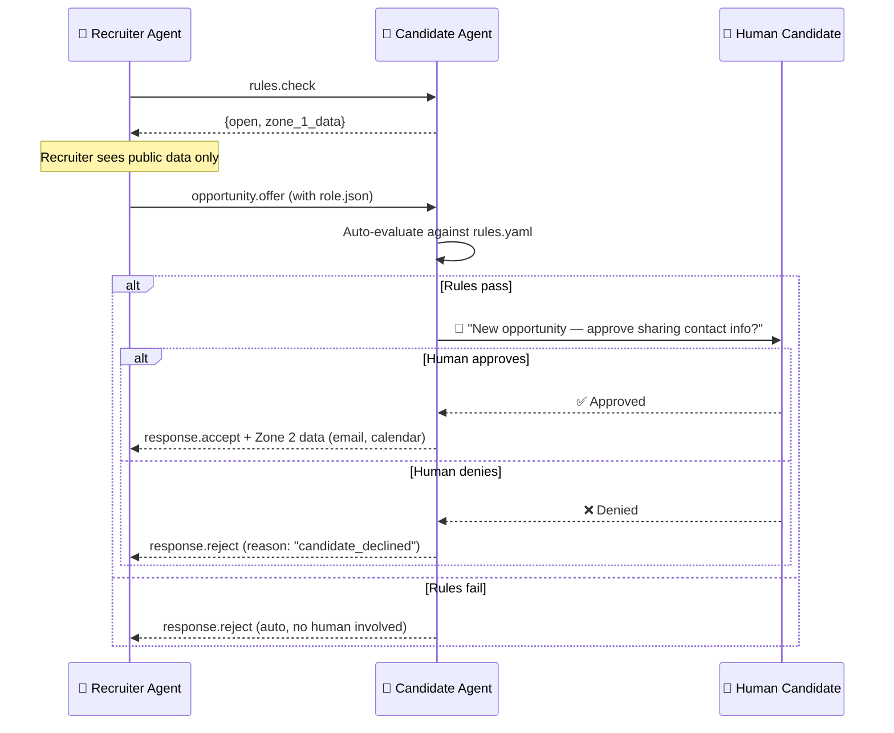

# 🔒 Privacy & GDPR Compliance

> Privacy is a protocol feature, not an afterthought. The Scoutica network uses a Zone-based access model that ensures PII is never exposed without explicit consent.

---

## 1. The Three Zones

All data in the Scoutica ecosystem is classified into three privacy zones:

### Zone 1: Public (Anonymous Access)
Data that is safe for the entire internet to see.

**Candidate Data:**
| Field | Example |
|-------|---------|
| Professional title | "Senior AI Architect" |
| Skill domains (broad) | ["Backend", "AI/ML", "DevOps"] |
| Seniority level | "senior" |
| Availability status | "in_2_weeks" |
| Public evidence links (GitHub repos, blog) | github.com/user/project |
| Card last-updated date | 2026-03-25 |

**Recruiter Data:**
| Field | Example |
|-------|---------|
| Organization name | "NovaTech AI" |
| Industry sectors | ["AI", "SaaS"] |
| Trust level | "established" |
| Verified domain (bool) | true |
| Engagement types offered | ["permanent", "contract"] |

### Zone 2: Gated (Verified Access)
Data revealed only after a successful handshake (mutual interest confirmed).

**Candidate Data:**
| Field | Unlock Condition |
|-------|-----------------|
| Full name | After `response.accept` |
| Email address | After `response.accept` |
| Phone number | After mutual confirmation |
| Calendar booking link | After `response.accept` |
| Detailed salary expectations | After `rules.check` passes |
| Private evidence (certifications, NDAs) | After manual approval |

**Recruiter Data:**
| Field | Unlock Condition |
|-------|-----------------|
| Hiring manager name | After candidate accepts |
| Direct email | After candidate accepts |
| Numeric trust score | After verification |
| Ghosting history | After verification |

### Zone 3: Mutual (Bilateral Unlock)
Data that requires both sides to explicitly agree.

| Data | Conditions |
|------|-----------|
| Interview scheduling | Both sides confirm interest |
| Contract terms | Both sides sign intent |
| Reference contacts | Candidate manually approves per-recruiter |
| Full compensation package details | Both sides agree to transparent negotiation |

---

## 2. GDPR Compliance Map

### 2.1 Legal Basis for Processing

| Activity | Legal Basis (GDPR Art.) | Notes |
|----------|------------------------|-------|
| Candidate creates card | Art. 6(1)(a) — Consent | User explicitly generates and publishes |
| Recruiter reads Zone 1 data | Art. 6(1)(f) — Legitimate Interest | Publicly available data |
| Recruiter receives Zone 2 data | Art. 6(1)(a) — Consent | Candidate explicitly shares after `accept` |
| Trust score computation | Art. 6(1)(f) — Legitimate Interest | Aggregate, non-personal behavioral metrics |
| Data retention in registry | Art. 5(1)(e) — Storage Limitation | Auto-delete inactive cards after 12 months |

### 2.2 Data Subject Rights Implementation

| Right | Implementation |
|-------|---------------|
| **Right to Access** (Art. 15) | `scoutica privacy audit <recruiter>` — shows exactly what data was accessed |
| **Right to Erasure** (Art. 17) | `scoutica delete` — removes card from all registries + GitHub |
| **Right to Portability** (Art. 20) | Card files are standard JSON/YAML — inherently portable |
| **Right to Object** (Art. 21) | `scoutica privacy block <recruiter>` — permanently blocks a specific org |
| **Right to Restriction** (Art. 18) | `scoutica privacy pause` — freezes card visibility without deletion |

---

## 3. Consent Flow



---

## 4. Data Minimization Rules

### 4.1 What is NEVER transmitted
- Government ID numbers (SSN, passport)
- Date of birth
- Home address
- Health information
- Religious or ethnic data
- Political affiliation

### 4.2 What is transmitted ONLY with explicit per-interaction consent
- Full legal name
- Email address
- Phone number
- Salary history (only future expectations are shared, never history)

### 4.3 Logging & Audit Trail
Every data access event is logged in a local, append-only transparency file:
```json
{
  "timestamp": "2026-03-25T14:30:00Z",
  "accessor": "novatech-ai",
  "zone": 1,
  "fields_accessed": ["title", "skills", "seniority"],
  "accessor_trust_level": "established"
}
```
This file is stored at `~/.scoutica/privacy/access_log.json` and is never sent externally.

---

## 5. Cross-Border Considerations

| Region | Requirement | Scoutica Response |
|--------|------------|-------------------|
| EU/EEA | GDPR full compliance | Zone model + consent flows |
| UK | UK GDPR (post-Brexit) | Same as EU |
| California (US) | CCPA/CPRA | "Do Not Sell" flag in `rules.yaml` |
| Brazil | LGPD | Consent model compatible |
| International | Data localization | Cards are self-hosted (GitHub/user server) — no central database stores PII |
