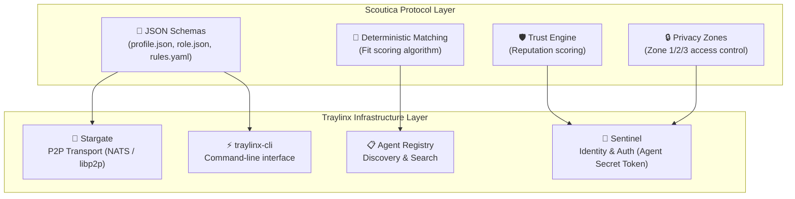
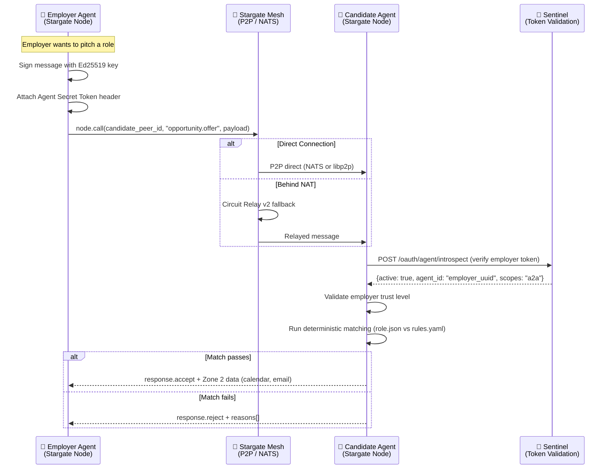

# 🌌 Stargate Integration — Scoutica Protocol on Traylinx Infrastructure

> Scoutica is a **protocol layer** that runs on top of the **Traylinx Stargate** decentralized mesh network. This document maps every Scoutica network requirement to existing Traylinx infrastructure.

---

## 1. Architecture Overview



**Core Principle:** Scoutica defines the *what* (schemas, rules, scoring). Traylinx provides the *how* (transport, identity, discovery).

---

## 2. Requirement-to-Infrastructure Mapping

### 2.1 Identity & Verification

| Scoutica Requirement | Traylinx Solution | Component |
|---------------------|-------------------|-----------|
| Recruiter identity verification | **Agent Secret Token** — AES-256-GCM encrypted, non-transferable credential | Sentinel |
| Ed25519 keypair for signing messages | **Stargate Identity** — `traylinx stargate identity --generate` | Stargate |
| DNS domain verification | **Sentinel certificate** — `traylinx stargate certify` | Sentinel + Stargate |
| Dual-token auth (access + agent secret) | **Sentinel dual-token flow** — OAuth 2.0 + Agent Secret Token | Sentinel |
| Zero-trust verification | **Introspection API** — `POST /oauth/agent/introspect` validates token without shared secrets | Sentinel |

### 2.2 Discovery & Search

| Scoutica Requirement | Traylinx Solution | Component |
|---------------------|-------------------|-----------|
| Find candidates by skills/location | **Agent Registry Full-Text Search** — PostgreSQL GIN indexed | Agent Registry |
| Ranked results (freshness, evidence) | **Weighted ranking** — Success Rate, Latency, Freshness scoring | Agent Registry |
| Agent capability registration | **Agent Registration** — agents register with `capabilities: ["scoutica-candidate"]` | Agent Registry |
| Heartbeat / liveness detection | **Heartbeat tracking** — in-memory batching for high performance | Agent Registry |
| DHT-based peer discovery | **Stargate Discovery** — `node.discover()` via DHT or NATS subjects | Stargate |

### 2.3 Messaging & Communication

| Scoutica Requirement | Traylinx Solution | Component |
|---------------------|-------------------|-----------|
| `rules.check` / `opportunity.offer` messages | **Stargate `node.call(peer_id, method, payload)`** — direct P2P RPC | Stargate |
| Signed message envelopes | **Ed25519 signing** + Agent Secret Token header | Stargate + Sentinel |
| NAT traversal (agents behind firewalls) | **Circuit Relay v2** — production-ready with automatic failover | Stargate |
| Multi-transport fallback | **NATS → libp2p → Circuit Relay** priority chain | Stargate |
| Message handler registration | **`@node.on_message("opportunity.offer")`** decorator pattern | Stargate |

### 2.4 Trust & Reputation

| Scoutica Requirement | Traylinx Solution | Component |
|---------------------|-------------------|-----------|
| Agent activity monitoring | **Activity Monitoring API** — tracks all auth, introspection, A2A events | Sentinel |
| Ghosting detection (response time SLA) | **Activity logs with timestamps** — query by `start_date/end_date` | Sentinel |
| Spam detection (rejection rate) | **Multi-Agent Filtering** — monitor rejection patterns across agents | Sentinel |
| Trust score computation | **Analytics & Metrics API** — aggregated success rates, performance data | Sentinel |
| Audit trail | **Export Capabilities** — JSON, CSV, JSONL formats + S3 archiving | Sentinel |

---

## 3. How Scoutica Messages Travel (Zero Central Servers)



**Key point:** At no point does any message pass through a Scoutica server. Everything flows through the Stargate P2P mesh, validated by Sentinel cryptography.

---

## 4. Scoutica Agents as Stargate Nodes

### 4.1 Candidate Agent Registration

```python
from traylinx_stargate import StarGateNode

candidate_agent = StarGateNode(
    display_name="sebastian-candidate",
    capabilities=["scoutica-candidate", "senior", "ai-ml", "remote-eu"]
)
await candidate_agent.start()

@candidate_agent.on_message("rules.check")
async def handle_rules_check(payload):
    # Read local rules.yaml and respond
    return {"status": "open", "availability": "in_2_weeks"}

@candidate_agent.on_message("opportunity.offer")
async def handle_offer(payload):
    # Run deterministic matching
    fit_score = evaluate_fit(payload["role_url"], local_rules)
    if fit_score >= 75:
        return {"type": "response.accept", "calendar": "https://cal.com/..."}
    return {"type": "response.reject", "reasons": ["salary_below_minimum"]}
```

### 4.2 Employer Agent Registration

```python
employer_agent = StarGateNode(
    display_name="traylinx-employer",
    capabilities=["scoutica-employer", "ai", "saas", "remote"]
)
await employer_agent.start()

# Discover candidates
candidates = await employer_agent.discover(
    capabilities=["scoutica-candidate", "senior", "ai-ml"]
)

# Pitch to each matching candidate
for peer in candidates:
    result = await employer_agent.call(peer.id, "opportunity.offer", {
        "role_url": "github.com/traylinx/.scoutica/roles/ai-architect.json",
        "compensation": {"base_min": 120000, "base_max": 150000}
    })
```

### 4.3 Dual-Agent (Same Person, Both Roles)

```python
# One person, two Stargate nodes, one AI router
candidate_node = StarGateNode(display_name="sebastian-candidate", 
                               capabilities=["scoutica-candidate"])
employer_node = StarGateNode(display_name="sebastian-employer-traylinx",
                              capabilities=["scoutica-employer"])

await candidate_node.start()
await employer_node.start()

# Harvey/SwitchAI routes incoming messages to the correct node
```

---

## 5. What Scoutica Adds on Top of Stargate

Stargate provides the pipes. Scoutica adds the business logic:

| Layer | Stargate Provides | Scoutica Adds |
|-------|------------------|---------------|
| **Identity** | Ed25519 keys + Agent Secret Token | Recruiter Card schema, trust levels, DNS verification mapping |
| **Discovery** | DHT + Registry + Full-Text Search | Skill-based matching, seniority filters, compensation range queries |
| **Messaging** | `node.call()` + signed envelopes | 6 standardized message types (`rules.check`, `opportunity.offer`, etc.) |
| **Trust** | Activity monitoring + metrics | Trust score formula, decay functions, anti-gaming rules |
| **Privacy** | TLS 1.3 + encrypted payloads | Zone model (public/gated/bilateral), GDPR consent flows |
| **Team** | N/A (no concept of org) | Team model (solo/organization/agency), per-org trust scoring |

---

## 6. CLI Integration

Scoutica commands live inside `traylinx-cli` as a plugin:

```bash
# Stargate commands (already exist)
traylinx stargate identity --generate
traylinx stargate certify
traylinx stargate discover

# Scoutica commands (new plugin)
traylinx scoutica scan          # Candidate: generate profile.json
traylinx scoutica validate      # Candidate: validate card
traylinx scoutica publish       # Candidate: push to GitHub
traylinx scoutica org init      # Employer: create recruiter card
traylinx scoutica org verify    # Employer: DNS verification
traylinx scoutica role create   # Employer: create role.json
traylinx scoutica role publish  # Employer: register role in network
traylinx scoutica jobs search   # Either: search the mesh for matching roles/candidates
```

---

## 7. What Does NOT Need to Be Built

Because Traylinx already provides these:

- ❌ P2P transport layer (Stargate has NATS + libp2p)
- ❌ Identity/keypair system (Stargate has Ed25519)
- ❌ Authentication (Sentinel has Agent Secret Token)
- ❌ Token introspection (Sentinel has introspection API)
- ❌ Agent registry (Agent Registry has registration + discovery + search)
- ❌ NAT traversal (Stargate has Circuit Relay v2)
- ❌ Activity monitoring (Sentinel has full logging + analytics)
- ❌ CLI framework (traylinx-cli already exists)

### What DOES Need to Be Built (Scoutica-Specific)

- ✅ JSON Schemas (`recruiter_profile.json`, `role.json`, `reputation.json`, `message.json`)
- ✅ Deterministic fit scoring algorithm
- ✅ Trust score computation engine (runs on Sentinel activity data)
- ✅ Privacy zone enforcement middleware
- ✅ Stargate message handlers for the 6 Scoutica message types
- ✅ CLI plugin for `traylinx scoutica *` commands
- ✅ Team/org model mapping to Agent Registry
