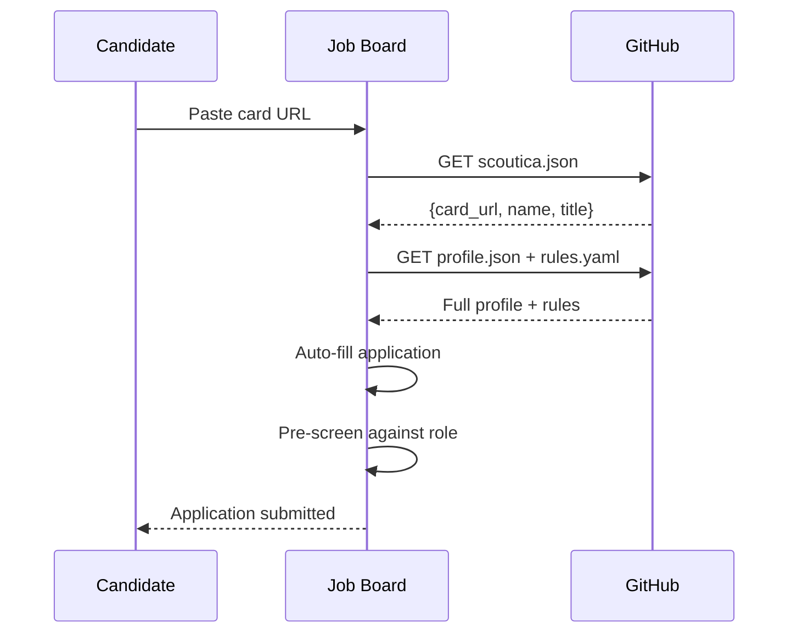

The Scoutica discovery protocol defines how AI agents and platforms locate Skill Cards without relying on a centralised database. There are four supported discovery methods.

## The scoutica.json well-known file

`scoutica.json` is placed at the root of any repository to declare that it contains a Scoutica Skill Card — similar to `robots.txt` but for AI-readable professional profiles.

```json
{
  "scoutica": "0.1.0",
  "card_url": "https://raw.githubusercontent.com/user/my-card/main",
  "name": "Full Name",
  "title": "Professional Title",
  "seniority": "senior",
  "domains": ["Backend Engineering", "DevOps"],
  "availability": "in_2_weeks",
  "entity_type": "human",
  "updated": "2026-03-23"
}
```

### Required and optional fields

| Field | Required | Description |
|---|---|---|
| `scoutica` | Yes | Protocol version (semver, e.g. `0.1.0`) |
| `card_url` | Yes | Base URL for fetching card files |
| `name` | Yes | Candidate's professional name |
| `title` | No | Professional title |
| `seniority` | No | One of: `entry`, `junior`, `mid`, `senior`, `lead`, `manager`, `director`, `executive` |
| `domains` | No | Top professional domains (Zone 1 — public) |
| `availability` | No | One of: `immediately`, `in_2_weeks`, `in_4_weeks`, `in_8_weeks`, `not_looking` |
| `entity_type` | No | One of: `human`, `ai_agent`, `service`, `robot`, `team`, `organization` (default: `human`) |
| `updated` | No | Last card update date in ISO 8601 format |

## Checking if a repo contains a card

```python
def discover_card(github_url):
    """Check if a GitHub repo contains a Scoutica Protocol card."""
    raw = github_url.replace("github.com", "raw.githubusercontent.com") + "/main"
    resp = requests.get(f"{raw}/scoutica.json")
    if resp.status_code == 200:
        return resp.json()
    return None
```

## Discovery methods

<AccordionGroup>
  <Accordion title="1. scoutica.json (well-known file)">
    The primary discovery method. Fetch `scoutica.json` from the root of any GitHub repository. Returns the `card_url` and summary metadata without requiring authentication.
  </Accordion>
  <Accordion title="2. Registry index">
    The Scoutica registry maintains a searchable index of published cards. Query by skills, seniority, domains, or availability to retrieve a list of matching `card_url` values. Suitable for bulk discovery.
  </Accordion>
  <Accordion title="3. GitHub topics">
    Repositories tagged with the `scoutica-card` GitHub topic can be discovered via the GitHub Search API. Use the topic filter `topic:scoutica-card` to find candidates.
  </Accordion>
  <Accordion title="4. Direct URL">
    If a candidate shares their card URL directly (e.g. on a CV or profile page), use it as the `base_url` to fetch card files without any discovery step.
  </Accordion>
</AccordionGroup>

## Pattern 1: Job board import flow

The following sequence describes how a job board can use the discovery protocol to auto-fill an application from a candidate's card URL.



<Info>
  This pattern lets candidates apply to jobs without filling out any forms. The platform fetches structured data directly from their card and pre-screens for obvious mismatches before submitting.
</Info>
