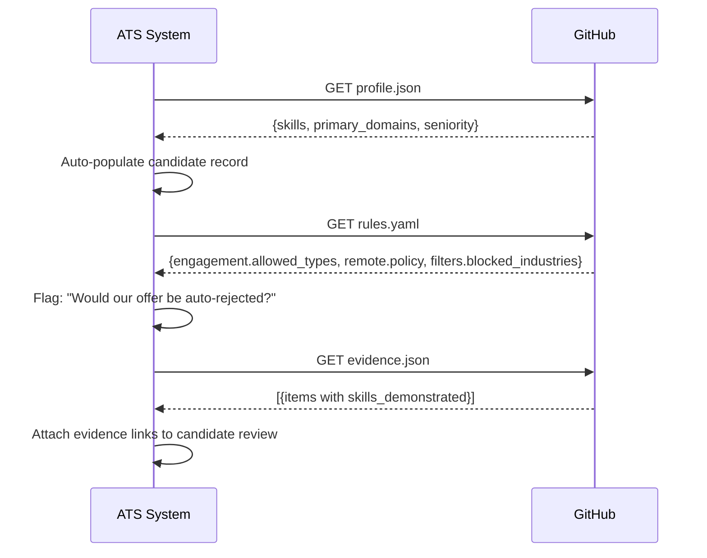

The Scoutica Protocol provides JSON Schema definitions for every card file. Validate cards before processing them to catch malformed data early.

## Validating with Python

```python
import json, jsonschema

# Load schema
with open('protocol/platform/01_schemas/candidate_profile.schema.json') as f:
    schema = json.load(f)

# Validate
with open('profile.json') as f:
    profile = json.load(f)

jsonschema.validate(profile, schema)  # Raises ValidationError if invalid
```

Install the dependency with:

```bash
pip install jsonschema pyyaml
```

## Available schemas

The schemas live in `protocol/platform/01_schemas/` in the repository:

| Schema file | Validates |
|---|---|
| `candidate_profile.schema.json` | `profile.json` — skills, seniority, primary domains, experience |
| `roe.schema.json` | `rules.yaml` — engagement types, compensation floors, remote policy, filters, privacy zones |
| `evidence.schema.json` | `evidence.json` — evidence items, URLs, skills demonstrated |
| `scoutica_discovery.schema.json` | `scoutica.json` — discovery metadata (in `schemas/` at repo root) |

<Note>
  The three card schemas (`candidate_profile`, `roe`, `evidence`) live in `protocol/platform/01_schemas/`. The discovery schema (`scoutica_discovery`) lives in `schemas/` at the repository root.
</Note>

## CLI validation

The Scoutica CLI validates an entire card directory in one command:

```bash
scoutica validate ./my-card/
```

This checks all card files against their schemas and reports any validation errors:

```text
🔍 Validating Scoutica Card: /path/to/my-card

✅ SKILL.md: Valid (frontmatter present)
✅ Candidate Profile: Valid
✅ Evidence Registry: Valid
✅ Rules of Engagement: Valid
✅ rules/: All 4 rule files present

Results: 5 passed, 0 failed, 0 warnings
🎉 Card is valid!
```

## Integration patterns

### Pattern 2: ATS integration

An applicant tracking system can use the protocol to auto-populate candidate records and pre-flag offer mismatches before a recruiter even opens the profile.



### Pattern 3: Embeddable widget

Embed a Scoutica Protocol badge on any personal website. The widget reads the card at runtime and renders a live profile summary.

```html
<!-- Scoutica Protocol badge for personal websites -->
<div id="scoutica-badge"
     data-url="https://github.com/user/my-card"
     data-theme="dark">
</div>
<script src="https://cdn.scoutica.dev/widget.js"></script>
```

<Note>
  The widget fetches and validates the card client-side on page load. Use `scoutica validate` locally before publishing your card to catch issues before they affect the live widget.
</Note>
