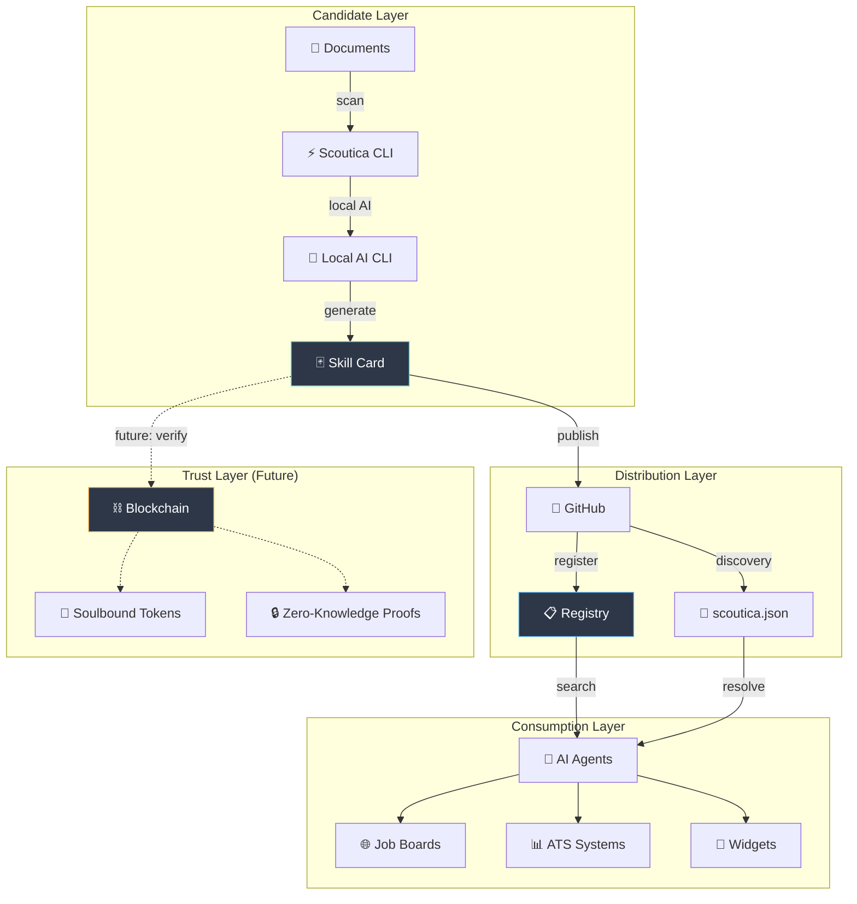
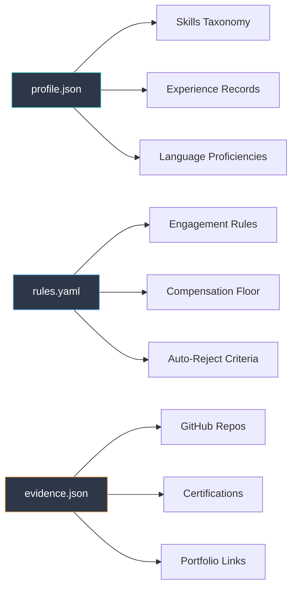
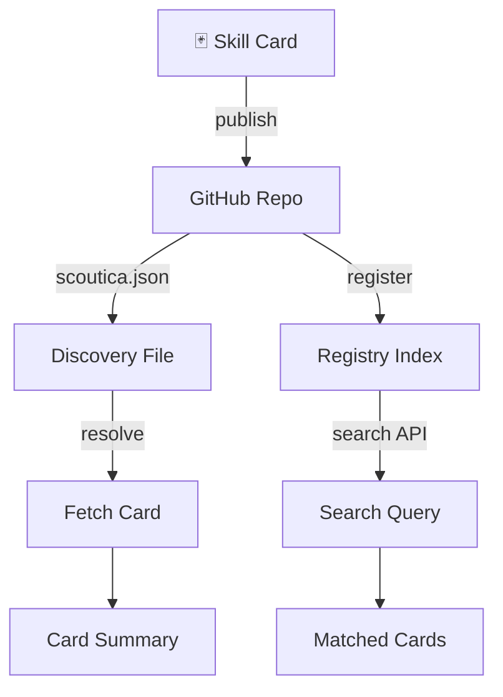
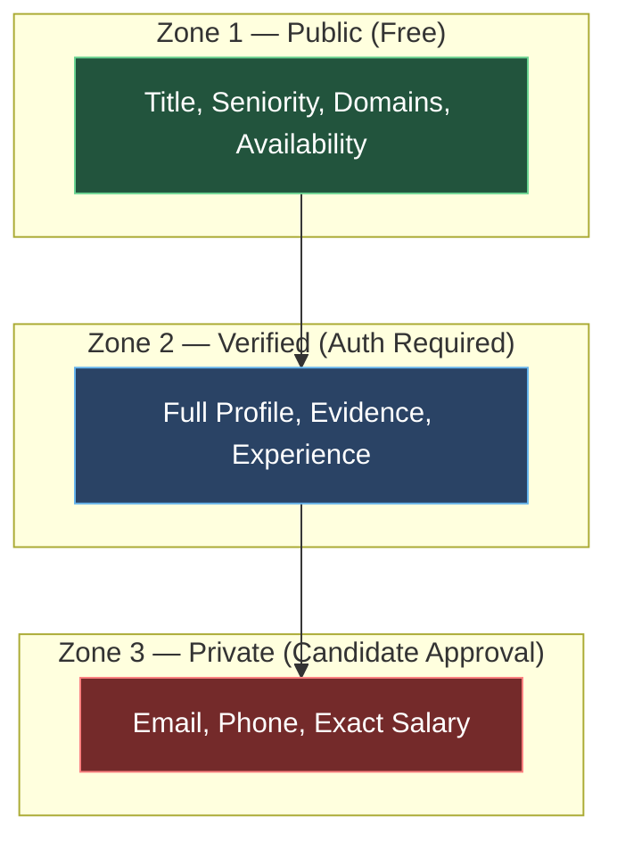
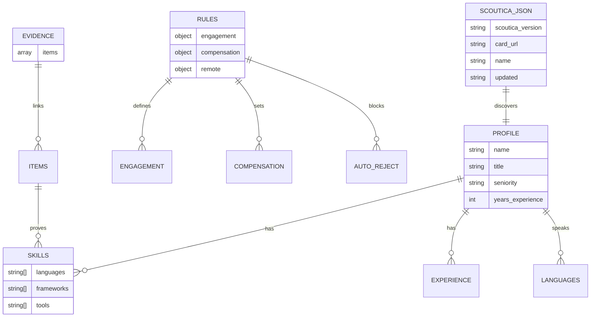

# Scoutica Protocol — Architecture

> **Protocol design, data model, and system components.**
>
> [User Manual](USER_MANUAL.md) | [Developer Guide](DEVELOPER_GUIDE.md) | [Use Cases](USE_CASES.md) | [Roadmap](../.specs/ROADMAP.md)

---

## System Overview

---

## The 6 Pillars

The Scoutica Protocol is built on 6 foundational pillars:

### Pillar 1: Generation

How Skill Cards are created.

| Method | Command | Description |
|--------|---------|-------------|
| AI Scan | `scoutica scan` | Auto-generate from documents via local AI |
| Interactive | `scoutica init` | Step-by-step wizard |
| Manual | Create files directly | For developers |
| AI Paste | `scoutica scan --clipboard` | Copy prompt, paste in any AI |

**Schema hierarchy:**

### Pillar 2: Distribution

How cards are discovered and accessed.

**Discovery mechanisms:**
1. **scoutica.json** — well-known file at repo root
2. **Registry index** — centralized JSON index (GitHub-based)
3. **GitHub Topics** — tag repos with `scoutica-card`
4. **Direct URL** — `scoutica resolve <url>`

### Pillar 3: Verification

How trust is established (5 levels).

| Level | Name | Trust Score | Description |
|-------|------|-------------|-------------|
| 0 | Self-Asserted | 0.0x | Candidate claims it |
| 1 | URL-Verified | 0.5x | Evidence URLs are reachable |
| 2 | Peer-Endorsed | 1.0x | Other cards vouch for skills |
| 3 | Platform-Verified | 1.5x | CI/CD: commits, contributions verified |
| 4 | Blockchain-Verified | 2.0x | Soulbound Token endorsement |

### Pillar 4: Agentic Extension

The protocol supports multiple entity types:

| Entity Type | Description | Example |
|-------------|-------------|---------|
| `human` | Individual professional | Software engineer |
| `ai_agent` | Autonomous AI agent | Coding assistant |
| `service` | API or SaaS | Translation API |
| `robot` | Physical system | Warehouse drone |
| `team` | Group of entities | Engineering squad |
| `organization` | Company or department | DevOps team |

### Pillar 5: Privacy & Security

**Three-zone data model:**

**GDPR compliance:**
- Candidate owns all data
- Right to deletion (delete repo = disappear)
- Right to portability (standard JSON/YAML)
- Transparency (candidates see exactly what agents see)

### Pillar 6: Economics

Revenue flows in the Scoutica Protocol ecosystem.

| Actor | Revenue Stream | Amount |
|-------|---------------|--------|
| Candidate | Micro-fee per Zone 2 access | ~$0.05 |
| Protocol | Commission on micro-fees | 10% |
| Verifier | Fee for endorsing skills | Market rate |
| Registry | Subscription for premium search | TBD |

**Cost comparison:**

| Channel | Cost Per Hire |
|---------|-------------|
| LinkedIn Recruiter | ~$10,000/year |
| Recruiting Agency | $15,000–$30,000 |
| **Scoutica Protocol** | **~$4** |

---

## Data Model

### Card File Relationships

---

## Protocol Compliance

### EU AI Act Requirements

Recruiting AI is classified as **High-Risk** under the EU AI Act. All implementations must:

1. **Human-in-the-loop** — No fully automated hiring decisions
2. **Audit trail** — Log every evaluation with reasoning
3. **Transparency** — Candidates see the same data as employers
4. **Non-discrimination** — No demographic inference or bias
5. **Explainability** — Score breakdown with matched/missing skills

### Anti-Discrimination by Design

The profile schema **deliberately excludes**:
- Gender, age, ethnicity, nationality
- Photos or visual identifiers
- Marital status, religion, disability

Evaluation is based **solely** on: skills, experience, evidence, and engagement rules.

---

## Further Reading

- [User Manual](USER_MANUAL.md) — End-user guide
- [Developer Guide](DEVELOPER_GUIDE.md) — Build integrations
- [Use Cases](USE_CASES.md) — Real-world scenarios
- [Roadmap](../.specs/ROADMAP.md) — Future development
- [Protocol Flows](../.specs/protocol_flows.md) — Sequence diagrams
- [Ecosystem Analysis](../.specs/protocol_ecosystem.md) — Consumption analysis
