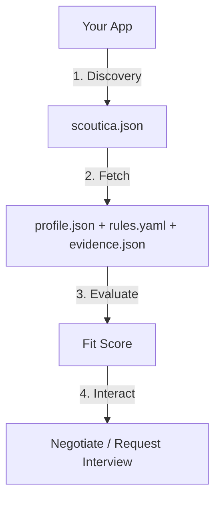
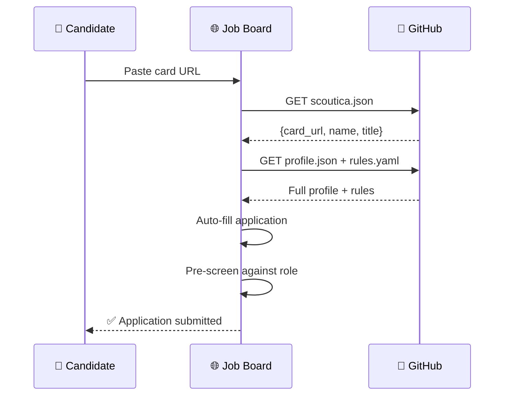
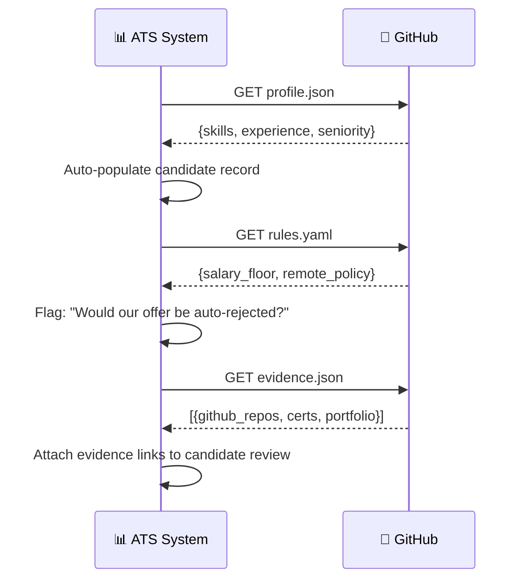

# Scoutica Protocol — Developer Guide

> **Build apps, plugins, and integrations that consume the Scoutica Protocol.**
>
> [User Manual](USER_MANUAL.md) | [Use Cases](USE_CASES.md) | [Architecture](ARCHITECTURE.md) | [Roadmap](../.specs/ROADMAP.md)

---

## Overview

The Scoutica Protocol defines a standard way for AI agents and applications to:

1. **Discover** professional profiles via `scoutica.json`
2. **Read** structured data from `profile.json`, `rules.yaml`, `evidence.json`
3. **Evaluate** candidates using rule templates
4. **Interact** via negotiation and interview handoff protocols



---

## Fetching a Skill Card

### From GitHub (Most Common)

```python
import requests, json

BASE = "https://raw.githubusercontent.com/{user}/{repo}/main"

def fetch_card(base_url):
    """Fetch all Scoutica Protocol card files from a base URL."""
    return {
        'profile': requests.get(f"{base_url}/profile.json").json(),
        'rules': requests.get(f"{base_url}/rules.yaml").text,
        'evidence': requests.get(f"{base_url}/evidence.json").json(),
        'discovery': requests.get(f"{base_url}/scoutica.json").json(),
    }

card = fetch_card("https://raw.githubusercontent.com/user/my-card/main")
print(card['profile']['name'])    # "Alice Developer"
print(card['profile']['skills'])  # {languages: [...], frameworks: [...]}
```

### JavaScript / Node.js

```javascript
async function fetchCard(baseUrl) {
  const [profile, rules, evidence] = await Promise.all([
    fetch(`${baseUrl}/profile.json`).then(r => r.json()),
    fetch(`${baseUrl}/rules.yaml`).then(r => r.text()),
    fetch(`${baseUrl}/evidence.json`).then(r => r.json()),
  ]);
  return { profile, rules, evidence };
}

// Usage
const card = await fetchCard('https://raw.githubusercontent.com/user/my-card/main');
console.log(card.profile.name);
```

### Go

```go
type Profile struct {
    Name           string   `json:"name"`
    Title          string   `json:"title"`
    Seniority      string   `json:"seniority"`
    YearsExp       int      `json:"years_experience"`
    Domains        []string `json:"domains"`
    Skills         Skills   `json:"skills"`
}

type Skills struct {
    Languages        []string `json:"languages"`
    Frameworks       []string `json:"frameworks"`
    ToolsAndPlatforms []string `json:"tools_and_platforms"`
}
```

### CLI

```bash
scoutica resolve https://github.com/user/my-card
scoutica resolve https://github.com/user/my-card ./local-copy/
```

---

## Discovery Protocol

### scoutica.json

Place at the root of any repo to declare "this contains a Scoutica Protocol card":

```json
{
  "scoutica": "0.1.0",
  "card_url": "https://raw.githubusercontent.com/user/my-card/main",
  "name": "Full Name",
  "title": "Professional Title",
  "seniority": "senior",
  "domains": ["Backend Engineering", "DevOps"],
  "availability": "in_2_weeks",
  "entity_type": "human",
  "updated": "2026-03-23"
}
```

**Search for cards:**

```python
def discover_card(github_url):
    """Check if a GitHub repo contains a Scoutica Protocol card."""
    raw = github_url.replace("github.com", "raw.githubusercontent.com") + "/main"
    resp = requests.get(f"{raw}/scoutica.json")
    if resp.status_code == 200:
        return resp.json()
    return None
```

---

## Evaluating a Candidate

### Skills Matching Algorithm

```python
def score_candidate(profile, job_requirements):
    """Score a candidate's profile against job requirements."""
    candidate_skills = set()
    for category in profile.get('skills', {}).values():
        if isinstance(category, list):
            candidate_skills.update(s.lower() for s in category)
    
    required = set(s.lower() for s in job_requirements.get('required_skills', []))
    nice_to_have = set(s.lower() for s in job_requirements.get('nice_to_have', []))
    
    matched = required & candidate_skills
    bonus = nice_to_have & candidate_skills
    
    if not required:
        return 100
    
    score = (len(matched) / len(required)) * 100
    score += len(bonus) * 5  # 5 bonus points per nice-to-have
    
    return min(score, 100)
```

### Rules Pre-Screening

**Always check rules BEFORE contacting a candidate:**

```python
import yaml

def pre_screen(rules_text, offer):
    """Check if an offer passes the candidate's Rules of Engagement."""
    rules = yaml.safe_load(rules_text)
    rejections = []
    
    # Check blocked industries
    blocked = rules.get('auto_reject', {}).get('blocked_industries', [])
    if offer.get('industry') in blocked:
        rejections.append(f"Industry '{offer['industry']}' is blocked")
    
    # Check engagement type
    allowed_types = rules.get('engagement', {}).get('allowed_types', [])
    if allowed_types and offer.get('engagement_type') not in allowed_types:
        rejections.append(f"Engagement type '{offer['engagement_type']}' not allowed")
    
    # Check salary
    min_salary = rules.get('compensation', {}).get('minimum_base_eur')
    if min_salary and min_salary != 'negotiable':
        if offer.get('salary', 0) < int(min_salary):
            rejections.append(f"Salary {offer['salary']} below minimum {min_salary}")
    
    # Check remote policy
    policy = rules.get('remote', {}).get('policy')
    if policy == 'remote_only' and offer.get('location_required'):
        rejections.append("Candidate requires fully remote")
    
    return {
        'status': 'REJECTED' if rejections else 'PASS',
        'reasons': rejections
    }
```

### Scoring Thresholds

| Score | Verdict | Recommended Action |
|-------|---------|-------------------|
| 80–100 | `STRONG_MATCH` | Proceed to interview |
| 60–79 | `GOOD_MATCH` | Review and decide |
| 40–59 | `WEAK_MATCH` | Only if other factors compensate |
| 0–39 | `NO_MATCH` | Do not proceed |
| Rule violation | `REJECTED` | Auto-reject, do not present |

---

## Evidence Verification

```python
def verify_evidence(evidence_json):
    """Verify each evidence item is reachable."""
    results = []
    for item in evidence_json.get('items', []):
        url = item.get('url', '')
        try:
            resp = requests.head(url, timeout=5, allow_redirects=True)
            results.append({
                'title': item['title'],
                'url': url,
                'verified': resp.status_code < 400,
                'status': resp.status_code
            })
        except:
            results.append({
                'title': item['title'],
                'url': url,
                'verified': False,
                'status': 'unreachable'
            })
    
    verified = sum(1 for r in results if r['verified'])
    return {
        'total': len(results),
        'verified': verified,
        'trust_ratio': verified / max(len(results), 1),
        'items': results
    }
```

---

## Schema Validation

Validate card files against the protocol schemas:

```python
import jsonschema

# Load schema
with open('schemas/candidate_profile.schema.json') as f:
    schema = json.load(f)

# Validate
with open('profile.json') as f:
    profile = json.load(f)

jsonschema.validate(profile, schema)  # Raises ValidationError if invalid
```

Available schemas:
- `schemas/candidate_profile.schema.json` — profile.json validation
- `schemas/rules_of_engagement.schema.json` — rules.yaml validation
- `schemas/evidence.schema.json` — evidence.json validation
- `schemas/scoutica_discovery.schema.json` — scoutica.json validation

---

## Integration Patterns

### Pattern 1: Job Board Import



### Pattern 2: ATS Integration



### Pattern 3: Embeddable Widget

```html
<!-- Scoutica Protocol badge for personal websites -->
<div id="scoutica-badge"
     data-url="https://github.com/user/my-card"
     data-theme="dark">
</div>
<script src="https://cdn.scoutica.dev/widget.js"></script>
```

---

## Data Security Rules

1. **Cache responsibly** — refresh cards every 24 hours minimum
2. **Respect privacy zones** — Zone 1 is public, Zone 2 needs auth, Zone 3 needs approval
3. **Never store Zone 3 data** — email, phone, exact salary are ephemeral only
4. **Audit trail** — log every card access for EU AI Act compliance
5. **Candidate can revoke** — if card is deleted, purge all cached data
6. **Anti-discrimination** — never evaluate on demographics, only skills and evidence

---

## Further Reading

- [User Manual](USER_MANUAL.md) — End-user CLI guide
- [Use Cases](USE_CASES.md) — Real-world scenarios
- [Architecture](ARCHITECTURE.md) — Protocol design
- [Roadmap](../.specs/ROADMAP.md) — Future development plans
- [Agent Skills](../.agents/skills/) — Skills for AI agent consumption
