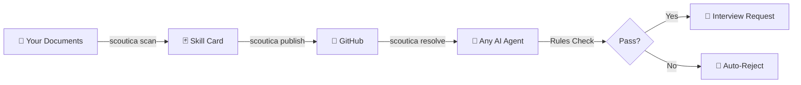

# Scoutica Protocol — User Manual

> **Version 0.1.0** | [GitHub](https://github.com/traylinx/scoutica-protocol) | [Developer Guide](DEVELOPER_GUIDE.md) | [Use Cases](USE_CASES.md) | [Architecture](ARCHITECTURE.md)

## What Is the Scoutica Protocol?

The Scoutica Protocol is an open standard for **AI-readable, candidate-owned professional profiles**. Instead of uploading CVs to job boards that own your data, you create a **Skill Card** — a set of structured files that any AI agent can discover, read, and act on.

**You own your data. You set the rules. Agents work for you.**



---

## Quick Start

### Install the CLI

**macOS / Linux:**
```bash
curl -fsSL https://raw.githubusercontent.com/traylinx/scoutica-protocol/main/install.sh | bash
source ~/.zshrc   # or source ~/.bashrc
```

**Windows (PowerShell):**
```powershell
irm https://raw.githubusercontent.com/traylinx/scoutica-protocol/main/install.ps1 | iex
```

### Create Your Skill Card

**Option 1: Auto-generate from documents (recommended)**

Put your CV, certifications, and portfolio in a folder, then:

```bash
scoutica scan ~/my-docs/ --output ./my-card/
```

The CLI auto-detects your local AI tool (Gemini CLI → Claude Code → Ollama → switchAILocal) and generates all 4 card files.

**Option 2: Interactive wizard**

```bash
scoutica init ./my-card/
```

Answer the questions step by step.

**Option 3: AI assistant (manual paste)**

```bash
scoutica scan ~/my-docs/ --clipboard
```

Copies the prompt to your clipboard — paste it into any AI chat.

### Validate & Publish

```bash
scoutica validate ./my-card/   # Check for errors
scoutica publish ./my-card/    # Push to GitHub
```

---

## CLI Reference

### `scoutica init [directory]`

Interactive wizard that guides you through creating your Skill Card.

```bash
scoutica init                  # Create in current directory
scoutica init ./my-card/       # Create in specific folder
scoutica init --ai             # Get AI-guided instructions
```

### `scoutica scan <docs-folder> [options]`

Auto-generate a Skill Card from your documents using a local AI CLI.

```bash
scoutica scan ~/CV/                        # Auto-detect AI CLI
scoutica scan ~/CV/ --with gemini          # Use specific provider
scoutica scan ~/CV/ --with claude          # Use Claude Code
scoutica scan ~/CV/ --with ollama          # Use Ollama (fully offline)
scoutica scan ~/CV/ --with ail             # Use switchAILocal
scoutica scan ~/CV/ --output ./my-card/    # Custom output directory
scoutica scan ~/CV/ --clipboard            # Copy prompt to clipboard
```

**Supported document formats:** `.md` `.txt` `.pdf` `.docx` `.json` `.yaml` `.csv` `.html`

**Supported AI providers:**

| Provider | CLI Command | Install |
|----------|------------|---------|
| Gemini CLI | `gemini` | [google-gemini/gemini-cli](https://github.com/google-gemini/gemini-cli) |
| Claude Code | `claude` | [anthropics/claude-code](https://github.com/anthropics/claude-code) |
| Ollama | `ollama` | [ollama.com](https://ollama.com) |
| switchAILocal | `ail` | [traylinx/switchAILocal](https://github.com/traylinx/switchAILocal) |

> **Privacy:** Your data never leaves your machine. The scan command pipes your documents to a local AI CLI — no cloud API calls.

### `scoutica resolve <url> [save-dir]`

Fetch and display any Scoutica Skill Card from a URL.

```bash
scoutica resolve https://github.com/user/my-card
scoutica resolve https://github.com/user/my-card ./local-copy/
```

**Supported URL formats:**
- `https://github.com/user/repo`
- `https://raw.githubusercontent.com/user/repo/main/`
- Any direct URL hosting card files

### `scoutica validate [directory]`

Validate your card against the protocol schemas.

```bash
scoutica validate              # Validate current directory
scoutica validate ./my-card/   # Validate specific folder
```

### `scoutica publish [directory]`

Push your card to GitHub.

```bash
scoutica publish               # Publish current directory
scoutica publish ./my-card/    # Publish specific folder
```

### `scoutica info [directory]`

Display a summary of your Skill Card.

```bash
scoutica info                  # Show info for current directory
scoutica info ./my-card/       # Show info for specific folder
```

### `scoutica doctor`

Run a system diagnostic check to verify that all prerequisites are installed correctly. It checks for the CLI executable, template directories, schema directories, Python 3, Git, and installed AI providers.

```bash
scoutica doctor
```

### `scoutica update`

Update the Scoutica Protocol CLI and rule templates to the latest version. This will safely overwrite your local installation with the newest release from the `main` branch.

```bash
scoutica update
```

---

## Your Skill Card Files

After creation, your card folder contains:

```
my-card/
├── profile.json        # Your skills, experience, tools
├── rules.yaml          # Your rules of engagement
├── evidence.json       # Links to your public work
├── SKILL.md            # Agent entry point
├── scoutica.json       # Discovery file (auto-generated)
└── rules/              # Evaluation rule templates
    ├── evaluate-fit.md
    ├── negotiate-terms.md
    ├── verify-evidence.md
    └── request-interview.md
```

### profile.json — Your Professional Profile

Machine-readable skills, experience, and capabilities.

```json
{
  "name": "Alice Developer",
  "title": "Lead Engineering Manager",
  "seniority": "lead",
  "years_experience": 19,
  "domains": ["Backend Engineering", "DevOps", "AI/ML"],
  "skills": {
    "languages": ["Python", "Go", "TypeScript"],
    "frameworks": ["FastAPI", "React", "Node.js"],
    "tools_and_platforms": ["Kubernetes", "AWS", "Docker"]
  }
}
```

### rules.yaml — Your Rules of Engagement

Define what you accept and reject. AI agents **must** respect these rules.

```yaml
engagement:
  allowed_types: [full_time, contract]
  notice_period: "30 days"

compensation:
  minimum_base_eur: negotiable

remote:
  policy: remote_first

auto_reject:
  blocked_industries: [gambling, weapons]
  no_relocation: true
```

### evidence.json — Your Public Work

Links to verifiable evidence of your skills.

```json
{
  "items": [
    {
      "type": "github_repo",
      "title": "switchAILocal",
      "url": "https://github.com/traylinx/switchAILocal",
      "skills": ["Go", "AI", "API Design"]
    }
  ]
}
```

### scoutica.json — Discovery File

Like `robots.txt` but for professional profiles. Any crawler or agent can check for this file at the root of a repo.

```json
{
  "scoutica": "0.1.0",
  "card_url": "https://raw.githubusercontent.com/user/my-card/main",
  "name": "Alice Developer",
  "title": "Lead Engineering Manager",
  "updated": "2026-03-23"
}
```

---

## Privacy & Data Ownership

### Your Data, Your Rules

1. **You own everything** — your card lives in your repo
2. **Scan is local** — documents never leave your machine
3. **Rules are enforced** — agents must respect your `rules.yaml`
4. **You can disappear** — delete the repo and you're gone from the network

### Privacy Zones

| Zone | Data | Who Can Access |
|------|------|---------------|
| **Zone 1** (Public) | title, seniority, domains, availability | Anyone |
| **Zone 2** (Verified) | full profile, evidence, experience | Authenticated agents |
| **Zone 3** (Private) | email, phone, exact salary | Only with your approval |

---

## Troubleshooting

### "scoutica: command not found"

```bash
source ~/.zshrc    # or source ~/.bashrc
```

### Scan shows "No readable documents found"

Supported formats: `.md`, `.txt`, `.pdf`, `.docx`, `.json`, `.yaml`, `.csv`, `.html`

### PDF text extraction fails

Install `pdftotext`:
```bash
brew install poppler     # macOS
apt install poppler-utils  # Linux
```

### "Empty response from provider"

Make sure your AI CLI is installed and working:
```bash
gemini --version    # or claude --version, or ollama list
```

---

## Further Reading

- [Developer Guide](DEVELOPER_GUIDE.md) — Build apps that consume the Scoutica Protocol
- [Use Cases](USE_CASES.md) — Real-world scenarios with flow diagrams
- [Architecture](ARCHITECTURE.md) — Protocol design and specifications
- [Roadmap](../.specs/ROADMAP.md) — Future development plans
- [Flow Diagrams](../.specs/protocol_flows.md) — Sequence diagrams for all interactions
