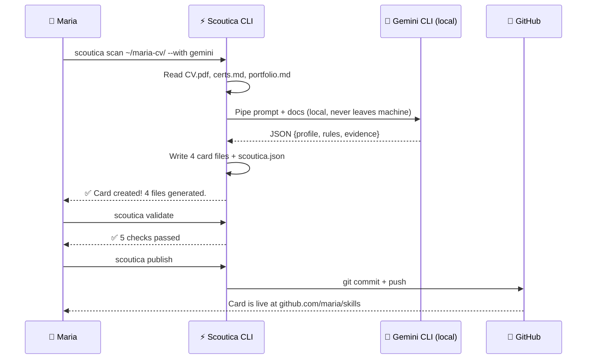
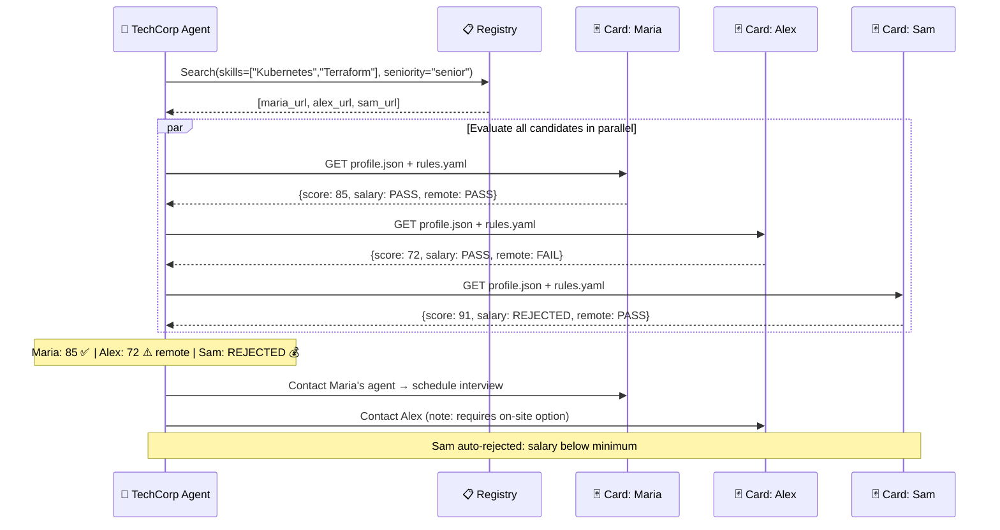
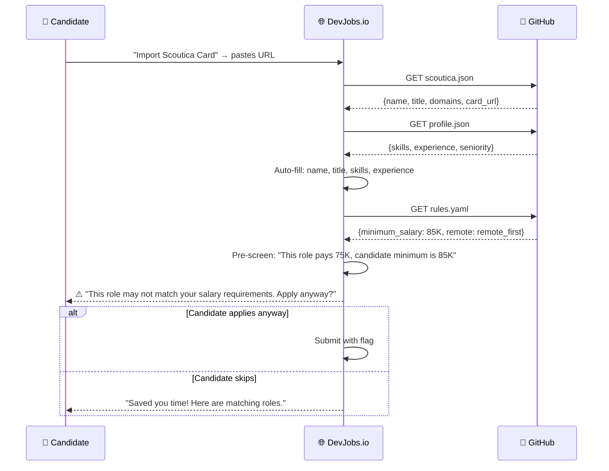
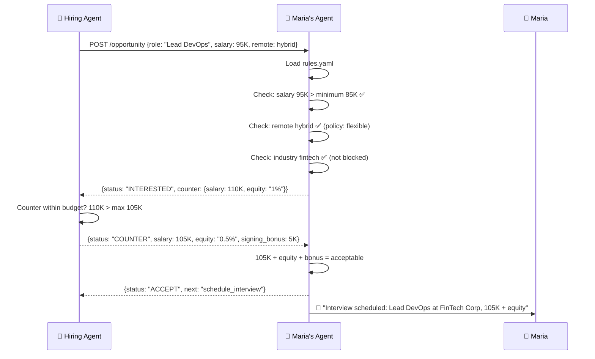
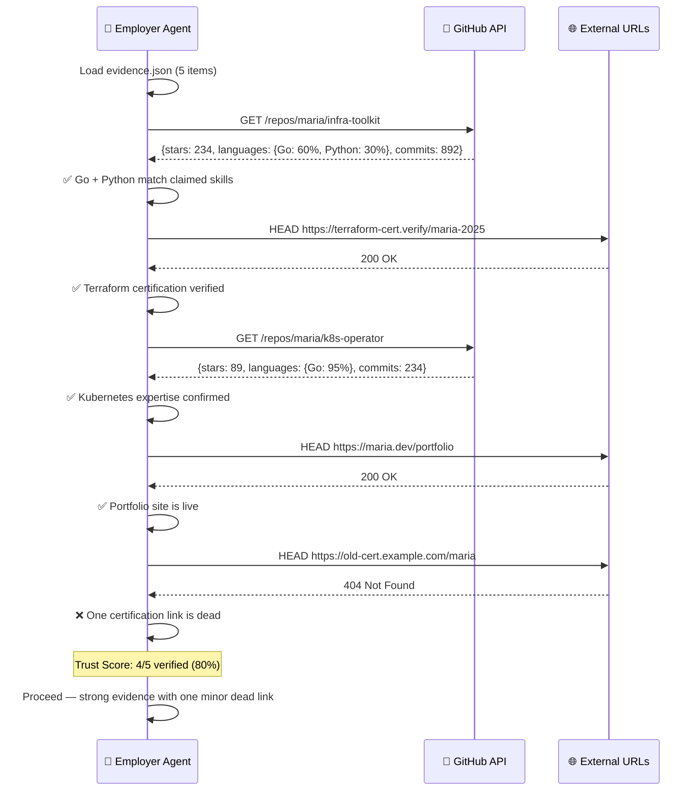
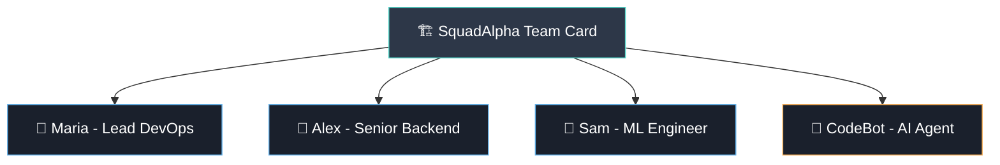
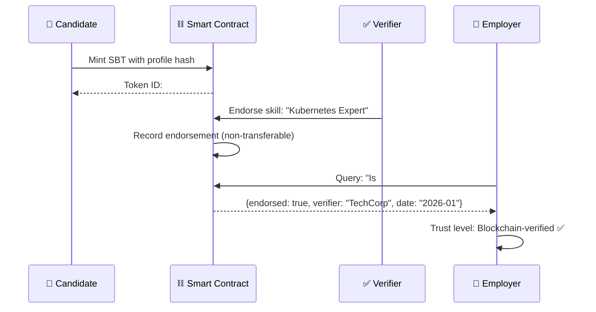

# Scoutica Protocol — Use Cases & Scenarios

> **Real-world scenarios showing how the Scoutica Protocol is used by candidates, recruiters, and platforms.**
>
> [User Manual](USER_MANUAL.md) | [Developer Guide](DEVELOPER_GUIDE.md) | [Architecture](ARCHITECTURE.md) | [Flow Diagrams](../.specs/protocol_flows.md)

---

## Scenario 1: Candidate Creates Their Card

> **Maria**, a senior backend engineer, wants to make her skills discoverable by AI agents without sharing her data with job boards.

**Result:** Maria's Skill Card is published. Her data never left her laptop. Any AI agent can now discover and evaluate her profile.

---

## Scenario 2: AI Recruiter Finds Candidates

> **TechCorp's AI agent** needs to fill a "Senior DevOps Engineer" position. It searches the Scoutica Protocol registry.

**Key insight:** Sam was never contacted — the agent respected the `rules.yaml` auto-reject for salary. No wasted time for either party.

---

## Scenario 3: Job Board Auto-Import

> **DevJobs.io** lets applicants import their Scoutica Protocol card instead of filling forms.

**Benefit:** Candidates don't fill forms. The platform pre-screens and warns about mismatches upfront.

---

## Scenario 4: Agent-to-Agent Negotiation

> **Maria's personal AI agent** receives an inbound opportunity and negotiates autonomously.

**Result:** Three negotiation rounds happened in seconds. Maria only gets notified when there's a concrete interview to schedule.

---

## Scenario 5: Evidence Verification

> **Before an interview**, an employer's agent verifies Maria's claimed evidence.

---

## Scenario 6: Team Card

> **SquadAlpha** — a team of 4 engineers — publishes a composite team card.

The team card aggregates:
- **Combined skills** across all members
- **Team rules** (availability, rate, engagement model)
- **Collective evidence** (team projects, joint publications)

This enables companies to hire entire teams, not just individuals.

---

## Scenario 7: Blockchain-Verified Card (Future)

> In the future, cards can be verified on-chain using Soulbound Tokens (SBTs).

**SBTs (Soulbound Tokens)** are non-transferable — they prove endorsement without being sellable.

---

## Summary: Which Scenario Applies to You?

| If You Are... | Start Here |
|----------------|-----------|
| A professional creating your card | [Scenario 1](#scenario-1-candidate-creates-their-card) |
| A company building a recruiting agent | [Scenario 2](#scenario-2-ai-recruiter-finds-candidates) |
| A platform adding Scoutica Protocol import | [Scenario 3](#scenario-3-job-board-auto-import) |
| Building autonomous agent negotiation | [Scenario 4](#scenario-4-agent-to-agent-negotiation) |
| Implementing evidence verification | [Scenario 5](#scenario-5-evidence-verification) |
| Creating team or org cards | [Scenario 6](#scenario-6-team-card) |
| Exploring blockchain verification | [Scenario 7](#scenario-7-blockchain-verified-card-future) |

---

## Further Reading

- [User Manual](USER_MANUAL.md) — CLI commands and card creation
- [Developer Guide](DEVELOPER_GUIDE.md) — Build integrations with code
- [Architecture](ARCHITECTURE.md) — Protocol design and schemas
- [Roadmap](../.specs/ROADMAP.md) — What's coming next
